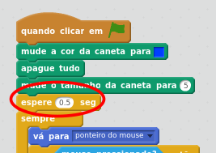

## Desenhando linhas

+ Abra o projeto de início

--- collapse ---
---
title: Eu estou usando Scratch online
---

+ Abra o projeto Scratch de início 'GATOS!' em [jumpto.cc/cats-go](http://jumpto.cc/cats-go){:target="_blank"}.

+ Se você tem uma conta Scratch, você pode clicar em  **Remix** no canto superior direito para salvar uma copia do projeto na sua conta.

--- /collapse ---

--- collapse ---
---
title: Eu estou usando Scratch offline
---

Baixar o [cats.sb2](resources/cats.sb2){:target="_blank"} projeto de início Scratch, e abrir ele usando o editor offline.

--- /collapse ---

+ Clique sobre o ator chamado **Pen**, e adicione código para definir a cor da caneta para o mesmo azul dos obstáculos do palco. Limpe a tela e defina o tamanho da caneta para 5.

Você pode selecionar a cor clicando sobre o bloco de cor (circundado) para trocar o cursor para pipeta, em seguida clique sobre a cor que deseja do palco.

+ Adicione um pouco mais de código para fazer o personagem seguir o ponteiro do mouse. Teste o seu programa para verificar que o código funciona.

[[[generic-scratch-saving]]]

+ Adicione algum código para dizer ao ator para desenhar uma linha no palco se o botão do mouse for apertado.

--- hints ---
--- hint ---
`Se` o `mouse pressionado`, então coloque `use a caneta`. `Senão` coloque `levante a caneta`.
--- /hint ---

--- hint ---
Aqui estão os blocos de código que você vai precisar:

--- /hint ---

--- hint ---
Assim é como seu código deve parecer:

--- /hint ---

--- /hints ---

+ Teste seu código. Você deve ser capaz de clicar e arrastar com o mouse para desenhar uma linha azul na tela.

Você provavelmente irá notar que um ponto azul sempre aparece no canto superior direito do seu palco (circundado em vermelho). Isto acontece porque quando você clica sobre a bandeira verde para iniciar o jogo, o mouse é pressionado, então a caneta imadiatamente inicia o desenho.

+ Adicione um bloco para esperar meio segundo antes do bloco `sempre` para impedir que isto aconteça. Caso ainda desenhe um ponto, adicione um bloco levantar caneta logo depois do bloco `quando clicar em bandeira verde`.

