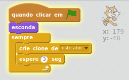
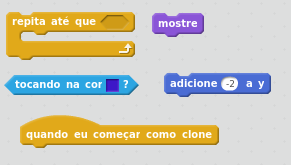
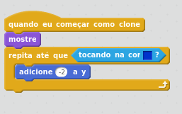

## Clonando os gatos

Queremos gerar um fluxo infinito de gatos que o jogador guie ao longo do caminho até a saída.

+ Clique no ator chamado ** Cat ** e adicione algum código para torná-lo invisível, e também para cloná-lo a cada três segundos.

Se você executar o programa no momento, nada acontecerá. Vamos fazer aparecer cada gato clonado cair do céu, então podemos verificar que um novo está sendo criado a cada três segundos.

+ Adicione algum código para dizer ao ator que quando ele começa como um clone, deve tornar-se visível e cair até chegar ao chão azul que é desenhado no palco

--- hints ---
--- hint ---
`Quando o ator começa como um clone`  `mostre` o ator. `Repita` isso até `tocar` o palco azul. `Mude` a coordenada y do ator para `-2`.
--- /hint ---

--- hint ---
Aqui estão os blocos de código que você precisará:

--- /hint ---

--- hint ---
É assim que o seu código deve aparecer:

--- /hint ---

--- /hints ---

Quando você pressionar a bandeira verde, você deve ver um novo gato caindo do céu a cada três segundos e pousando em uma grande pilha de gatos sobrepostos no chão azul no fundo.

