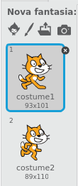
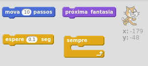
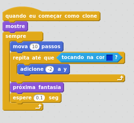
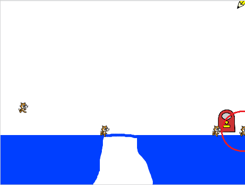
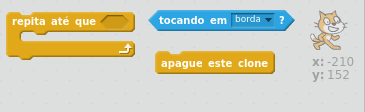
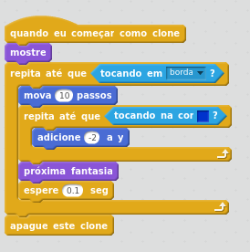
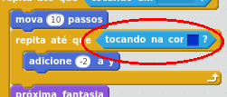
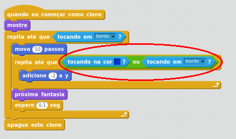

## Movendo gatos

Quando um gato aparecer e cair até chegar ao chão, queremos que ele pise lentamente para a direita.

+ Adicione um código ao `quando eu começar como clone` a seção para fazer o ator do gato mover dez passos, e alternar entre as duas fantasias a cada 0.1 segundos para fazer parecer que o gato está caminhando.

--- hints ---
--- hint ---
O ator do gato deve `mover 10 passos`, e `trocar de fantasia` a cada `0.1 segundos`. Este código (bem como o código para fazer cair o gato) deve repetir `para sempre`.
--- /hint ---

--- hint ---
Aqui estão os blocos de código que você precisará:

--- /hint ---

--- hint ---
É assim que o seu código deve aparecer:

--- /hint ---

--- /hints ---

+ Pressione a bandeira verde e verifique se os gatos agora se movem ao longo da plataforma azul na parte inferior.

Você notará que, se você desenhar uma ponte sobre o espaço para que os gatos possam chegar até a borda direita da tela, eles acabam ficando presos entrando na parede.

+ Remova o loop para sempre que você adicionou, e, em vez disso, adicione um loop diferente para que os gatos só caminhem até chegarem a uma borda. Quando um gato atinge a borda da tela, deve desaparecer.

--- hints ---
--- hint ---
Remova o loop para sempre e substitua-o por um loop diferente que repete `até que os gatos toquem a borda`. Uma vez que eles alcançam uma vantagem, adicione um bloco para `apague o clone`, o que fará desaparecer o gato.
--- /hint ---

--- hint ---
Aqui estão os novos blocos de código que você precisará adicionar:

--- /hint ---

--- hint ---
É assim que o seu código deve aparecer:

--- /hint ---

--- /hints ---

+ Pressione a bandeira verde e verifique se os gatos desaparecem quando atingem a borda da tela.

Você pode notar que os gatos não desaparecem devidamente se caírem no buraco, eles simplesmente ficam presos no fundo. Isso ocorre porque o ator está ficando preso tentando cair!

Este código diz ao gato para continuar caindo até tocar em azul. Contudo, no buraco o gato nunca chegará ao azul, então está preso para sempre.

+ Adicione mais blocos a este loop para dizer para repetir até tocar em azul `ou tocando a borda`. Deste jeito, o ator irá parar de tentar cair se atingir a borda da tela.

