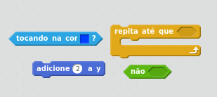

## Colando nas linhas

Quando estiver testando o seu jogo, você deve notar que se você desenhar uma ponte baixa entre as duas plataformas, ou uma linha que suba, os gatos irão terminarão andando através da plataforma ao invés de sobre ela!

+ No código do personagem gato, adicione um novo laço após o laço que faz o gato cair. Desta vez, o laço deve dizer ao gato para move para cima 2 unidades até que ele não esteja tocando o azul.

--- hints ---
--- hint ---
O gato deve `mover acima 2`, e isto deve `repetir até que ele não esteja tocando o azul`.
--- /hint ---

--- hint ---
Aqui estão os blocos de código que você vai precisar:

--- /hint ---  

--- hint ---
É assim que seu código deve parecer:

--- /hint ---

--- /hints ---

+ Clique na bandeira verde e tente desenhar uma linha que suba. Verifique que seu gato segue a linha.
