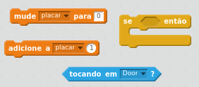
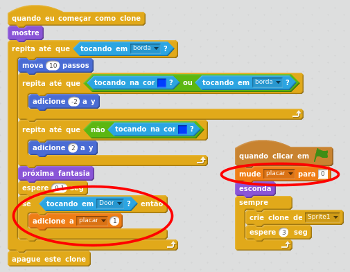
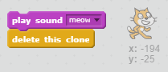

## Chegando em segurança

O objetivo deste jogo é guiar os gatos para a segurança utilizando um caminho seguro para que eles cheguem a porta. Vamos criar uma variável de placar para manter a contagem de quantos gatos conseguiram chegar a porta.

+ Criar uma variável chamada `placar`.

[[[generic-scratch-add-variable]]]

+ Adicione algum código no seu ator Sprite1(gato) para adicionar um ao placar cada vez que um gato alcançar a porta. Não esqueça de também definir zero ao placar no inicio do jogo.

--- hints ---
--- hint ---
`Se` o gato está `tocando o ator Door(porta)`, então `adicione 1 ao placar`.
--- /hint ---

--- hint ---
Aqui estão os novos blocos de código que você precisará adicionar:

--- /hint ---

--- hint ---
This is what your code should look like:

--- /hint ---

--- /hints ---

+ Add some more code so that a cat sprite that reaches the door makes a 'meow' sound and then disappears.

